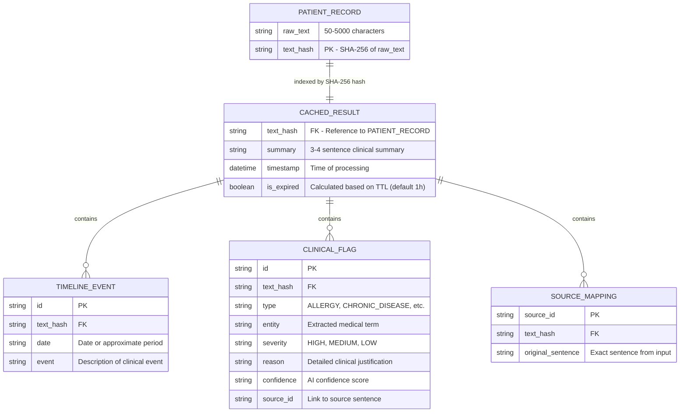

# Database Schema & Data Dictionary

MediBrief AI is primarily **stateless**. However, it utilizes a caching layer in the Spring Boot backend to prevent redundant AI processing of identical records.

## Entity-Relationship Diagram (ERD)

---

## Data Dictionary

### Table: `ProcessingCache` (In-Memory ConcurrentHashMap)
| Column Name | Data Type | Constraints | Description |
|---|---|---|---|
| `text_hash` | `String` | **Primary Key** | SHA-256 hash of the input medical text. |
| `response_json` | `JSON / Object` | Not Null | The full `PatientResponse` object containing summary, timeline, and flags. |
| `created_at` | `Long / Timestamp` | Not Null | System time when the result was cached. |

---

### Data Model: `ClinicalFlag`
| Field | Type | Constraints | Description |
|---|---|---|---|
| `type` | `Enum` | [ALLERGY, CHRONIC_DISEASE, ACUTE_EVENT, PAST_PROCEDURE, MEDICATION_NOTE] | The category of the clinical finding. |
| `entity` | `String` | Not Null | The specific medical term found (e.g., "Penicillin"). |
| `severity` | `Enum` | [HIGH, MEDIUM, LOW] | Risk level associated with the finding. |
| `reason` | `String` | Not Null | Explanation for why this flag was raised. |
| `confidence` | `Enum` | [HIGH, MEDIUM, LOW] | AI/Rule engine certainty level. |
| `sourceId` | `String` | Not Null | Unique identifier linking to the source sentence. |

---

### Data Model: `TimelineEvent`
| Field | Type | Constraints | Description |
|---|---|---|---|
| `date` | `String` | Not Null | Timestamp or relative time (e.g., "2018", "6 months ago"). |
| `event` | `String` | Not Null | Description of the medical occurrence. |

---

### Data Model: `SourceMap`
| Key | Value Type | Description |
|---|---|---|
| `entity_id` | `String` | Unique ID of an entity (e.g., `DISEASE_42`). |
| `sentence` | `String` | The exact sentence from the raw text where the entity was found. |
