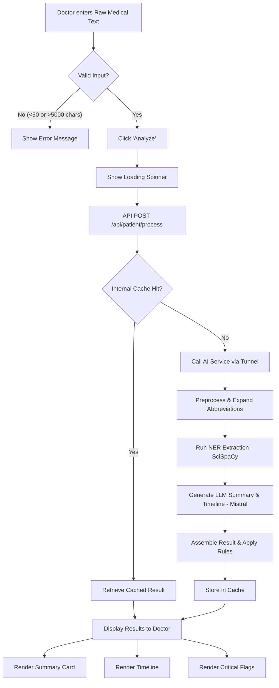
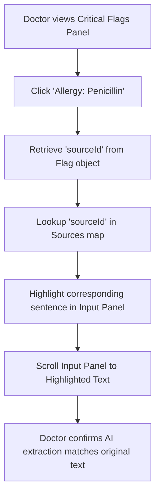
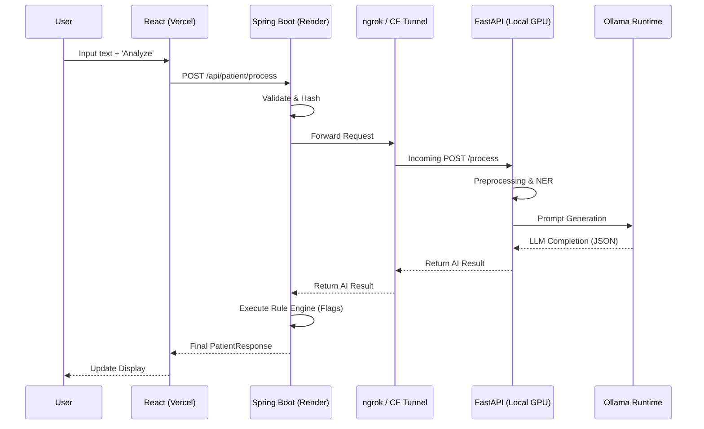

# User Flow Diagrams

The following Mermaid diagrams represent the critical user journeys within MediBrief AI.

## 1. Core Patient Record Processing

This flow covers the primary interaction of a doctor inputting raw medical text and receiving structured insights.

---

## 2. Source Traceability (Clinician Verification)

This flow illustrates how a doctor verifies a summary claim or critical flag by checking the original source.

---

## 3. Deployment & Communication Flow (Tunneling)

This technical flow shows how the distributed components interact across environments.

